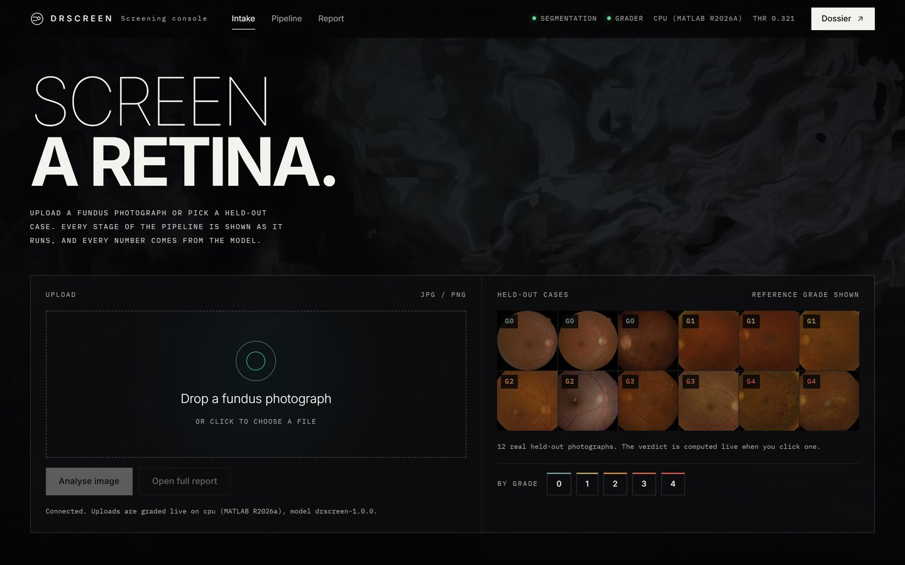
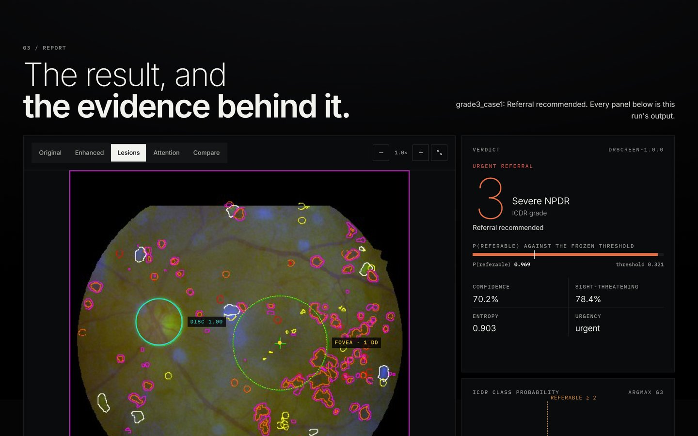
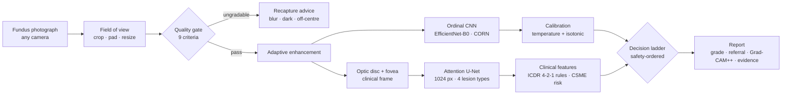

# SixEyes: Explainable Diabetic Retinopathy Screening for Rural India

**Smart India Hackathon 2026 · Problem statement SIH-26038 · Theme: MedTech · Team SixEyes**

A MATLAB screening system for the fundus camera at a rural health centre. From
one photograph it returns an audited referral decision in about 2.6 seconds on
an ordinary CPU, offline:

1. **checks the image** with nine interpretable quality criteria, and tells the technician how to recapture a bad one;
2. **finds the optic disc, the fovea and four lesion types** (microaneurysms, haemorrhages, hard and soft exudates);
3. **grades severity** on the ICDR scale with an ordinal network and calibrated confidence;
4. **explains every referral** with lesion counts per quadrant, the ICDR rule trail and a Grad-CAM++ heatmap;
5. **routes the patient** through a safety-ordered decision ladder: urgent, soon, human review, or a 12-month recall;
6. **sizes the district programme** around it with a Simulink / SimEvents model of the screening service.

<p align="center">
  
  
</p>

---

## Results at a glance

**Deployed model**: trained on APTOS-2019, IDRiD, DDR and Messidor-2; scored on
the held-out test split (n = 1,852); every cut-point fitted on the validation
split only.

| referable DR (ICDR grade ≥ 2) | value | 95% CI | target |
|---|---|---|---|
| **Sensitivity** | **91.5%** | 89.5–93.2 | ≥ 90% ✅ |
| **Specificity** | **88.7%** | 86.5–90.5 | ≥ 85% ✅ |
| AUC | 0.964 | 0.956–0.971 | |
| **Sight-threatening DR (grade ≥ 3) referred** | **99.7%** (298 / 299) | 98.1–99.9 | |
| Quadratic weighted κ · within one grade | 0.869 · 94.8% | | |

**Generalisation.** The earlier model, which never saw Messidor-2, referred
**97.3% of sight-threatening eyes (107 / 110)** on that French cohort at 92.2%
specificity (zero-shot, n = 1,744, AUC 0.908). Its referable sensitivity there
was 70.7%, the misses being almost all moderate NPDR, the grade on which
Messidor-2's adjudicated labels and APTOS's single-grader labels disagree most ([RESULTS.md §3](RESULTS.md#3-why-moderate-npdr-fails--the-reference-standards-disagree)).

**MATLAB edition.** 54 / 54 parity tests pass. On all 72 committed photographs,
grade, decision and urgency are identical to the Python reference with both
model bundles (144 / 144). About 2.6 s per photograph with the Deep Learning
Toolbox, 8 s without.

Every number, with confidence intervals, the ablation, and the bugs that only
real data exposed: **[RESULTS.md](RESULTS.md)**.

---

## Run it

Needs MATLAB R2021a or newer with the Image Processing Toolbox. The Deep
Learning Toolbox is optional; it makes screening about 3× faster. No Python, no
GPU and no internet connection are needed.

```matlab
cd matlab
launch_web          % screening console + project dossier at http://localhost:8000
```

| | what to do |
|---|---|
| **Screening console** (`localhost:8000`) | Drop a JPG/PNG, or click one of the 12 held-out photographs. Press **Analyse image** and watch each stage run. Read the verdict, the lesion and attention views and the calibrated probability, confirm or correct the grade, and open the printable report. |
| **Project dossier** (the **Dossier ↗** button) | The headline numbers, the nine pipeline stages, recorded runs you can replay, the evidence, programme sizing, and the Simulink district model running in the browser. |
| **Desktop app** | `launch_console`: the same pipeline as a MATLAB app, with batch screening of the 60-image showcase set. |
| **Batch and tests** | `run_demo` writes HTML reports for the 12 verification photographs. `run_validation` scores all 72 committed photographs. `run_tests` runs the parity suite. |
| **A clinic without MATLAB** | `build_standalone` (MATLAB Compiler) produces `DRScreenWeb.exe` and `DRScreenConsole.exe`, which run on the free MATLAB Runtime. |

The Simulink model of a district screening session (Simulink and SimEvents required):

```matlab
cd simulink
open_system('district_model'); sim('district_model')
R = run_district_model(p, 100);     % 100 independent replications
```

More in [matlab/README.md](matlab/README.md) and [simulink/README.md](simulink/README.md).

---

## How it works



Three choices do most of the work:

- **An ordinal head, not a softmax.** CORN models P(grade > k) directly, so the
  referral probability is monotone by construction and the referral and urgency
  thresholds read off one network.
- **Lesions at full resolution.** Microaneurysms are 5–10 pixels wide. At 512 px
  the U-Net's microaneurysm Dice is 0.000; at 1024 px it is 0.48.
- **A safety-ordered decision.** Neovascularisation and macular-oedema checks
  run before the referral cut-point. Borderline or uncertain cases go to a
  human, never to an automatic report.

The reasoning behind every design decision is in [docs/DESIGN.md](docs/DESIGN.md).

<p align="center">
  
</p>

---

## What the problem statement asks for, and where it is

| requirement | how it is met | where |
|---|---|---|
| Image quality assessment and recapture feedback | Nine physics-based criteria, run in milliseconds before any network; an ungradable photo stops with specific advice | `matlab/+drscreen/+preprocess/assessQuality.m` |
| Retinal structures and lesions | Analytic optic disc and fovea; attention U-Net for four lesion types at 1024 px | `+preprocess/locateLandmarks.m`, `+models/Segmenter.m` |
| Severity grading with confidence | EfficientNet-B0 with a CORN ordinal head, temperature and isotonic calibration, MC-dropout uncertainty | `+models/Grader.m`, `+models/calibrate.m` |
| Explainability | Grad-CAM++, per-quadrant lesion counts, the ICDR 4-2-1 rule trail, disc-diameter distances to the fovea | `+features/`, `+report/` |
| An integrated pipeline that beats single techniques | Ablation with DeLong and McNemar tests | [RESULTS.md §5](RESULTS.md#5-ablation--does-the-integrated-pipeline-beat-any-single-technique) |
| Telemedicine workflow simulation | A SimEvents model of a health-centre session; a SimPy optimiser over 1,024 programme configurations | [`simulink/`](simulink/), [docs/SIMULATION.md](docs/SIMULATION.md) |
| MATLAB | The deployed runtime is MATLAB R2026a, compilable to standalone apps | [`matlab/`](matlab/) |

The MATLAB paths above are under `matlab/+drscreen/`. The same stages exist in
Python under `src/drscreen/`, where the models were trained.

---

## Repository layout

```
matlab/          the screening system in MATLAB: pipeline, web server, desktop app,
                 exported weights, 54 parity tests, standalone build
simulink/        Simulink / SimEvents model of a district screening session, with figures
web/             screening console (index.html) and project dossier (prototype.html)
src/drscreen/    Python reference implementation: training, validation, SimPy simulation
scripts/         Python entry points: build cohorts, train, validate, demo, simulate
tests/           Python regression tests on clinical invariants
outputs/         evidence: deployable bundles, validation reports, run logs, verification set
docs/            design notes, simulation, datasets, reproduction steps, diagrams
RESULTS.md       every measured number, and how it was measured
```

## Documentation

| document | contents |
|---|---|
| [RESULTS.md](RESULTS.md) | Metrics with confidence intervals, external validation, ablation, calibration, the bugs real data exposed |
| [docs/DESIGN.md](docs/DESIGN.md) | The pipeline stage by stage, and why each design decision differs from the standard recipe |
| [docs/SIMULATION.md](docs/SIMULATION.md) | The telemedicine queueing model, the cost optimiser and the Simulink realisation |
| [matlab/README.md](matlab/README.md) | The MATLAB edition: requirements, deployment, API, fidelity to Python |
| [simulink/README.md](simulink/README.md) | The district model's variables, arrival process and validation |
| [docs/REPRODUCING.md](docs/REPRODUCING.md) | Training and validating from the public corpora (Python, GPU) |
| [docs/DATASETS.md](docs/DATASETS.md) | The four corpora, their licences and roles |
| [outputs/verification_set/README.md](outputs/verification_set/README.md) | The 12 held-out photographs the console ships with |

## Training and validation (Python)

The models are trained in the Python reference implementation and exported to
MATLAB (`matlab/tools/export_to_matlab.py`). To run it:

```bash
python -m venv .venv && .venv/Scripts/activate     # Linux/macOS: source .venv/bin/activate
pip install torch torchvision                        # the cu128 index for RTX 50-series GPUs
pip install -r requirements.txt && pip install -e .
python scripts/run_demo.py --demo                    # screens the 12 committed photographs
python -m pytest -q                                  # regression suite, real images throughout
```

Retraining needs the public corpora; see [docs/REPRODUCING.md](docs/REPRODUCING.md).

---

## Honest limitations

- **Two model bundles ship, and they are not interchangeable.** The MATLAB
  edition and the website serve `pooled` by default (all four corpora,
  `outputs/artifacts_all/`), which is better on every head-to-head measure but
  has no zero-shot cohort left. `prepool` (APTOS-2019 + IDRiD,
  `outputs/artifacts/`) is the model behind the 97.3% zero-shot figure, and the
  Python API's default. Every number in RESULTS.md states which bundle it
  belongs to.
- **Neovascularisation is not assessed.** No public corpus annotates it at pixel
  level, so the report says "not assessed" rather than "absent", and a full
  examination is still advised.
- **Moderate NPDR is the weak grade** (57% recall on the pooled test). It sits at
  the mild/moderate boundary, where the reference standards themselves disagree.
- **This is a research prototype, not a cleared device.** Nothing here has been
  through a clinical trial, a regulator or a prospective deployment. The cost
  figures in the programme model are order-of-magnitude inputs.

## Data and licences

The corpora are not redistributed; each requires accepting its own licence (see
[docs/DATASETS.md](docs/DATASETS.md)). The 12 verification photographs and the
60-image showcase set (`matlab/data/showcase/`) are real held-out photographs
from APTOS-2019, IDRiD and DDR. They are included for demonstration only and
remain under their source licences. Messidor-2 images are never committed.

## Not a diagnosis

This is decision-support output only. Every referable and every
sight-threatening finding is to be reviewed by a qualified ophthalmologist
before clinical action.
