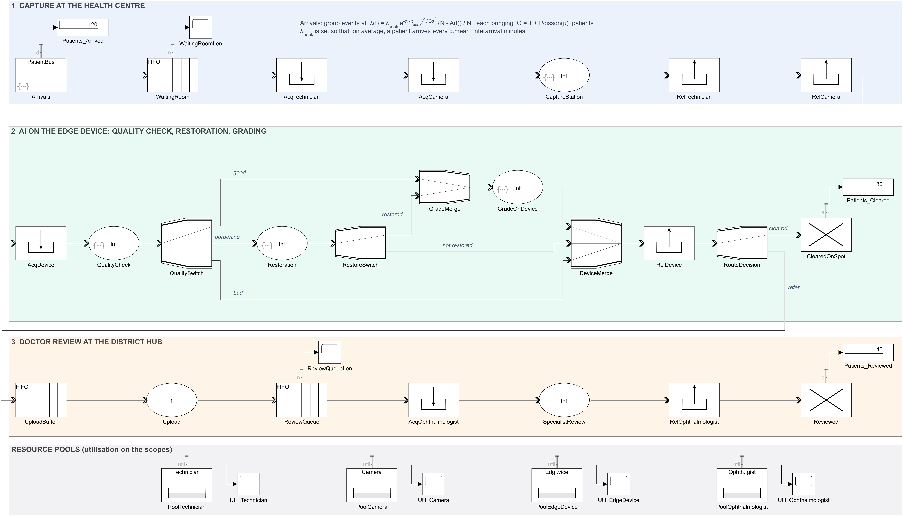

# District screening model (SimEvents)

`district_model.slx` models one health centre's screening session and the
doctor review it feeds. Time is in minutes; one run is a `p.sim_stop` (360)
minute session.

1. **Capture at the health centre.** Patients arrive in groups, wait in the
   waiting hall, take a technician and a camera, and are photographed
   (`t_capture`).
2. **AI on the edge device.** The AI checks each image and sorts it into good,
   borderline or bad. Borderline images are restored, and `p_restore` of them
   become gradeable. Gradeable images are graded, and the patient is either
   cleared on the spot or referred. A bad image, or one the restoration could
   not save, goes back for another capture when `include_gate = 1` (up to
   `max_attempts` captures). Otherwise it goes to the doctor ungraded.
3. **Doctor review at the district hub.** Referred images are uploaded, queue
   for an ophthalmologist, and are read (`t_review`).



The dossier's **Simulator** section (`web/prototype.html#simulator`) runs this
model in the browser. `web/district-sim.js` is a block-for-block port, and the
page draws the diagram from the `.slx` itself.

## Files

| file | what it is |
|---|---|
| `district_model.slx` | the model |
| `district_model_params.m` | **every variable the model uses; edit them here** |
| `build_district_model.m` | builds `district_model.slx` from those variables |
| `district_peak_rate.m` | the peak arrival rate implied by `mean_interarrival` (the Arrivals block calls it) |
| `district_model_check.m` | runs before every simulation: checks the variables against the model |
| `run_district_model.m` | replicates the model and logs its statistics |
| `export_district_model_figure.m` | renders the diagrams in `figures/` |
| `figures/` | `district_model.png` (300 dpi), `.svg`, `.pdf`, and the same for the recapture variant `district_model_recapture.slx` |
| `validation/*.json` | MATLAB's replications, which the web engine is checked against |
| `district_model.slx.zip` | the model as first shared, left as it was |

## Running it

```matlab
open_system('district_model');  sim('district_model');   % it loads district_model_params.m itself

p.n_technicians = 3;  p.mean_interarrival = 2;           % change a number...
sim('district_model');                                   % ...and run again

p.include_gate = 1;  build_district_model(p);            % change the structure: rebuild

R = run_district_model(p, 100);                          % 100 independent replications
export_district_model_figure();                          % the images in figures/
```

Every number the blocks use is read from `p` when the model runs, so editing
`p` in the workspace, or in `district_model_params.m`, takes effect on the next
run. Only `include_gate` and `add_scopes` change which blocks exist. If you
change either without rebuilding, the model stops before it runs and says so.

## The variables

| variable | value | meaning |
|---|---|---|
| `sim_stop` | 360 | minutes in the session (the model's stop time) |
| `mean_interarrival` | 3 | minutes between patients, on average over the session |
| `t_peak` | 150 | minutes after opening when arrivals peak |
| `sigma` | 90 | minutes: how widely arrivals spread around the peak |
| `N` | 200 | catchment: patients who may come this session |
| `mu` | 0.5 | mean companions per arrival event |
| `prevalence_referable` | 0.08 | share of patients with referable DR |
| `p_pass` | 0.70 | good images: graded as they are |
| `p_repair` | 0.15 | borderline images: restored first |
| `p_reject` | 0.15 | bad images: cannot be graded |
| `p_restore` | 0.873 | borderline images the restoration makes gradeable |
| `max_attempts` | 3 | captures allowed per patient (with `include_gate = 1`) |
| `t_capture` | 5 | minutes to photograph both eyes |
| `t_quality` | 0.01 | minutes for the AI quality check (it runs in milliseconds on CPU) |
| `t_restore` | 0.02 | minutes for the AI restoration of a borderline image |
| `t_grade` | 0.25 | minutes for AI grading on the edge device |
| `t_upload` | 0.67 | minutes to send a referred image to the hub |
| `t_review` | 0.5 | minutes for the doctor's read |
| `sensitivity`, `specificity` | 0.986, 0.873 | the grader's operating point |
| `n_technicians`, `n_cameras`, `n_edge_devices`, `n_ophthalmologists` | 5 each | resources |
| `cap_waiting_room`, `cap_upload_buffer`, `cap_review_queue` | 500, 1000, 1000 | queue capacities |
| `include_gate` | 0 | 1: bad images are recaptured. 0: they go to the doctor ungraded (rebuild after changing) |
| `add_scopes` | 1 | utilisation and queue scopes, and count displays (rebuild after changing) |
| `seed` | 1 | every random stream is seeded from it; change it for another, independent run |

The three image shares are used in proportion if they do not add up to 1.

## Arrivals

Group-arrival events happen at rate

    λ(t) = λ_peak · exp(−(t − t_peak)² / (2σ²)) · (N − A(t)) / N

where `A(t)` is the number of patients who have arrived by time `t`. Each
event brings `G = 1 + Poisson(μ)` patients: a patient and whoever came with
them.

The `Arrivals` block draws the events by thinning (Lewis and Shedler).
Candidate events come at the constant rate λ_peak, and each is kept with
probability λ(t)/λ_peak. Because λ(t) never exceeds λ_peak, the result is
exact. The rest of a group follows zero minutes later, and a group never
takes more than the catchment has left.

λ_peak is not set by hand. The rate is linear in `A`, so the expected number
of patients by time `T` has a closed form, exact apart from the cap on the
last group:

    E[A(T)] = N · (1 − exp(−(1 + μ) · λ_peak · G(T) / N))
    G(T)    = σ · √(2π) · (Φ((T − t_peak)/σ) − Φ(−t_peak/σ))

`district_peak_rate.m` sets `E[A(sim_stop)] = sim_stop / mean_interarrival`
and solves for λ_peak. That is a patient every 3 minutes on average: 120 in
the session. With the defaults, λ_peak = 0.575 events a minute, and the
session peaks at about 36 patients an hour, two hours in. MATLAB's 100 runs
average 119.3 patients.

## Design notes

- **Resources set how many work at once.** Each server takes anyone who
  reaches it (capacity `Inf`, as the icons show). A patient reaches the
  capture station only while holding a technician and a camera, and reaches
  the AI stages only while holding an edge device, so the pools do the
  limiting. Changing `n_cameras` is therefore enough; no server has to be
  edited to match. Utilisation is read from the pools, which the scopes in
  the bottom strip show.
- **Nobody is held up by a full block.** A patient with a technician waits in
  `AcqCamera` for a camera, and a photographed patient waits in `AcqDevice`
  for an edge device. Neither blocks the station behind them.
- **Independent runs.** Each MATLAB action in a SimEvents block keeps its own
  random stream, and SimEvents restarts it from MATLAB's default seed at the
  start of every simulation. The original model therefore repeated the same
  draws on every run, and the start of that sequence runs high: across 100
  runs it reported 12.5 reviews a session where its own parameters implied
  8.6. Here every action seeds its stream once per run from `p.seed` plus its
  own offset.

## Validation of the web engine

The same variables were run in MATLAB and in `web/district-sim.js`. A figure
agrees if the two means are within three standard errors. All 24 agree; the largest gap is 1.4 standard errors.

| configuration | source | arrived | borderline | cleared | uploaded | reviewed | technicians busy | edge devices busy | doctors busy |
|---|---|---|---|---|---|---|---|---|---|
| the model as set: 5 of each, a patient every 3 min, no recapture | MATLAB, 100 runs | 119.32 | 18.21 | 79.28 | 39.87 | 39.86 | 35.9% | 1.6% | 1.3% |
|  | web engine, 2,000 runs | 119.90 | 17.89 | 79.98 | 39.78 | 39.77 | 36.3% | 1.6% | 1.3% |
| recapture on; 3 technicians, 3 cameras, 2 edge devices, 1 doctor | MATLAB, 100 runs | 119.32 | 21.84 | 95.33 | 23.75 | 23.75 | 71.3% | 4.8% | 4.1% |
|  | web engine, 2,000 runs | 119.90 | 21.47 | 95.92 | 23.81 | 23.81 | 71.9% | 4.8% | 4.0% |
| a patient every 2 min (N 300), recapture on, 1 doctor at 5 min a read | MATLAB, 100 runs | 178.78 | 32.26 | 142.29 | 36.26 | 36.24 | 63.1% | 2.8% | 58.7% |
|  | web engine, 2,000 runs | 179.92 | 32.24 | 143.82 | 35.86 | 35.81 | 63.3% | 2.8% | 57.3% |

Utilisation is compared as SimEvents' resource pools report it. A pool's
statistic updates only when units are taken or given back, so the value at
the stop time is the average up to the pool's last such event. The engine
keeps the same reading.

The browser version also runs a whole district with the same blocks. Several
health centres share one review hub, and clinics and reviewers keep working
hours over many days, with backlog carried over. It can also vary service
times, review urgent cases first, and run a no-AI baseline.

Its **resource planner** is for whoever allocates staff and equipment. After
each run it re-runs the engine at every size of each resource, one resource at
a time. It finds the fewest capture teams (a technician with a camera) that
keep the average wait before capture under a target, then the fewest edge
devices that keep images from waiting more than a minute for the AI, then
the fewest doctors that read 90% of referrals within a target. It then says
what is spare and could serve another centre, and charts arrivals through the
session against the capture capacity. With the variables as set, one session
needs 3 technicians with 3 cameras, 1 edge device and 1 doctor, against
15 minutes and 1 hour.

To refresh the page's diagram and its starting variables after changing the
model, run `python scripts/build_district_web.py`.
